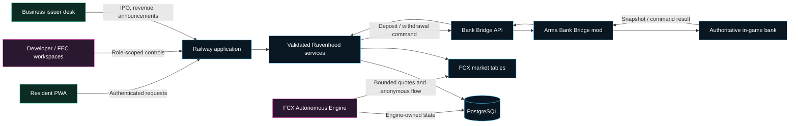
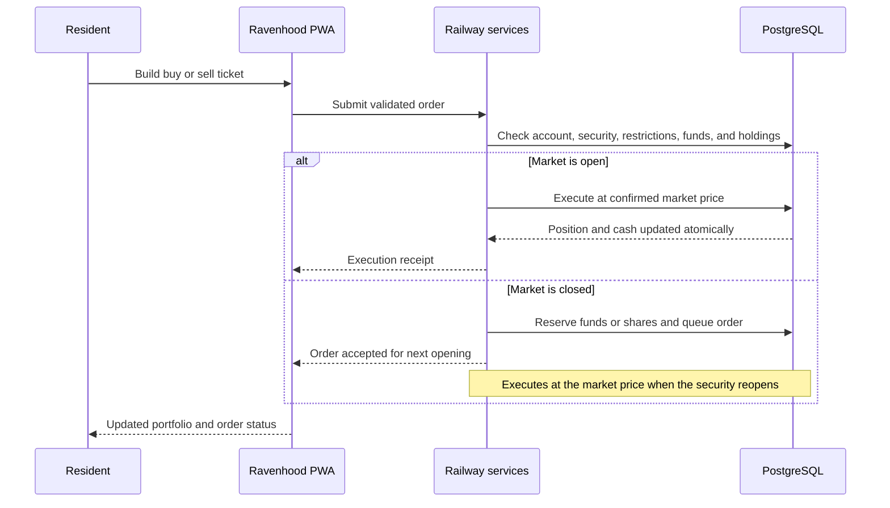
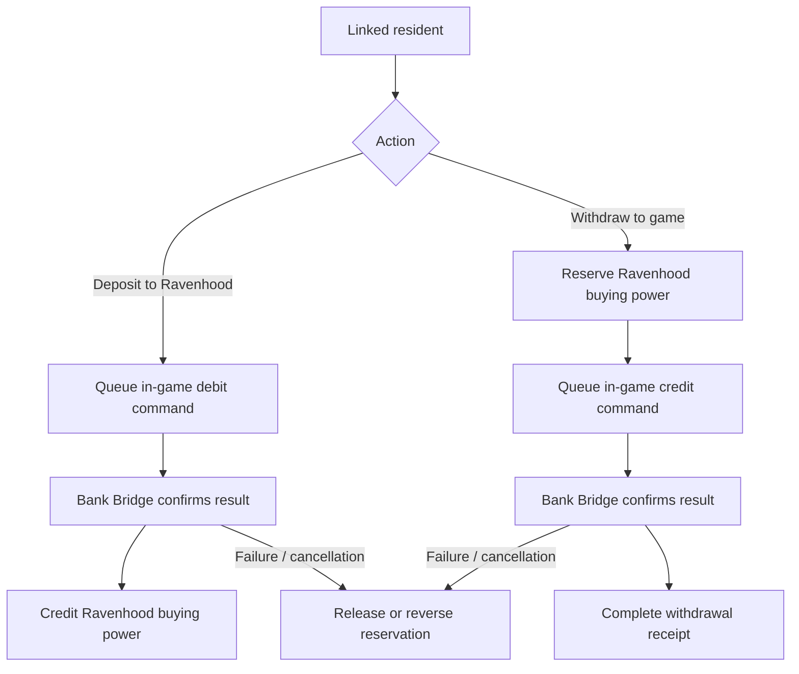
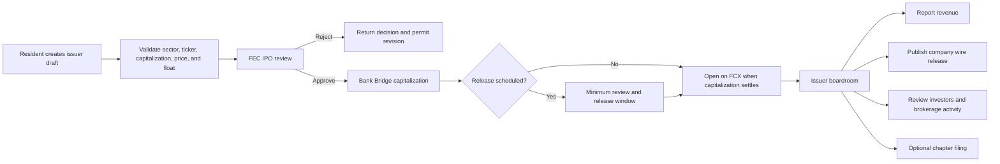

# Ravenhood Stock Exchange

## The Faircroft Exchange (FCX)

> A persistent, roleplay-native capital market connecting resident portfolios, autonomous market behavior, business IPOs, regulatory oversight, and verified in-game currency settlement.

**Presentation format:** GitHub Markdown  
**Platform:** Faircroft RP OS / Railway / PostgreSQL / Arma Reforger  
**Currency:** Fictional Faircroft in-game currency only  
**Status:** Integrated exchange platform

---

## Executive summary

Ravenhood is the resident-facing trading experience for the **Faircroft Exchange (FCX)**. It combines a modern securities interface with a persistent simulated market, developer controls, issuer tooling, regulatory workflows, and an auditable bridge to Arma Reforger's in-game bank.

The system is designed as more than a stock-price screen. It supports:

- Resident equity portfolios and buying power.
- Fractional and whole-share purchases.
- Market-session orders that wait for the next opening price.
- Long and short leveraged positions with configurable risk limits.
- FCXS and FCXV index funds.
- Autonomous market participants, events, liquidity, sentiment, and price discovery.
- Resident-created IPOs with FEC review and Bank Bridge capitalization.
- Company reporting, issuer announcements, investor intelligence, and bankruptcy workflows.
- FEC trading halts, account restrictions, delisting, investigations, and auditable asset custody.
- In-game deposits and withdrawals through the existing Bank Bridge.

Ravenhood never presents itself as a real brokerage. It is an original roleplay economy system using fictional in-game credits.

---

## The platform at a glance

| Capability | Ravenhood implementation |
|---|---|
| Exchange | Faircroft Exchange (FCX) |
| Operating listings | One-click bootstrap for 30 companies |
| Index products | FCXS Stability Index and FCXV Volatility Index |
| Market participants | Residents plus persistent simulated investor personalities |
| Order types | Immediate and queued equity orders; long and short margin positions |
| Position sizing | Whole shares, fractional shares, or cash-based sizing |
| Settlement | Ravenhood ledger with Bank Bridge deposits and withdrawals |
| Market intelligence | OHLC, EMA, VWAP, volatility, volume, market cap, rankings, and order flow |
| Issuer system | IPO creation, FEC approval, capitalization, scheduled listing, and company wire |
| Oversight | FEC investigations, halts, restrictions, delisting, custody, and audit records |
| Automation | Local FCX engine with optional Gemini and DeepSeek-assisted review paths |
| Safety | Advisory locking, bounded cycles, circuit breakers, kill switch, and role enforcement |

---

## Why Ravenhood exists

Faircroft already has residents, businesses, government agencies, courts, an in-game economy, and persistent identity. Ravenhood turns those systems into a living financial layer where roleplay actions can affect capital formation and market behavior.

It creates meaningful loops for several communities:

1. **Residents** can invest, trade, manage risk, and follow market activity.
2. **Business owners** can build an issuer, capitalize it, report revenue, and communicate with investors.
3. **FEC investigators** can monitor market integrity without gaining trading privileges.
4. **Developers** can operate the exchange, tune risk, schedule market events, and audit the system.
5. **The Arma server** remains the authoritative source for the resident's spendable in-game bank snapshot.

---

## System architecture

### Compatibility boundaries

- The FCX engine owns its own `fcx_engine_*` records.
- Autonomous operation does not write resident cash, holdings, orders, Arma links, or Bank Bridge commands.
- Quote integration is limited to market pricing/history and anonymous system-trade records.
- Deposits and withdrawals use the established Railway service and Bank Bridge path.
- The APK, PWA, Arma linking system, and Bank Bridge remain separate responsibility boundaries.

---

## Resident experience

Ravenhood is organized around the actions a resident actually needs:

- **Trade:** Explore active FCX securities and index funds.
- **Portfolio:** Review positions, equity, current gains or losses, and buying power.
- **Margin:** Open and monitor isolated long or short exposure.
- **Orders:** Review present, future, executed, and cancelled market orders.
- **Deposit:** Move verified in-game funds into Ravenhood buying power.
- **Withdraw:** Return whole-dollar buying power to the linked in-game account.
- **Transfer:** Send eligible Ravenhood value through validated account workflows.
- **Rewards:** Redeem authorized Faircroft promotions.

The responsive order ticket supports:

- Share-based or cash-based sizing.
- Whole-share sliders and direct fractional entry.
- Live estimated subtotal and commission.
- Long/short selection and permitted leverage.
- A modal workflow on desktop and a mobile-safe sheet on smaller screens.
- Refresh protection while a resident is actively entering an order.

---

## The market desk

Each security page brings trading data and execution into one workspace.

### Time ranges

- Live
- 15 minutes
- 1 hour
- 1 day
- 1 week
- 1 month
- 1 year

### Visible market intelligence

- Recorded OHLC candles and wick data.
- EMA 12 trend line.
- Session volume-weighted average price (VWAP).
- Volatility band.
- Statistical projection separated visually from recorded data.
- Trade volume and buy/sell pressure.
- Open, high, low, and current price.
- Market capitalization and FCX market-cap rank.
- Resident position and average cost.
- Anonymous live execution feed.

The chart supports historical navigation, zooming, panning, timeframe selection, and series visibility controls so residents can inspect market structure without exposing another player's identity.

---

## Equity order lifecycle

### Execution safeguards

- Verified resident account required.
- Active listing and valid lifecycle state required.
- FEC account and security restrictions enforced by the backend.
- Minimum order value enforced.
- Fees calculated at execution.
- Queued-order count is bounded.
- Reserved cash or shares prevent double spending.
- Queued orders can be cancelled before execution.
- Settlement updates are atomic.

---

## In-game currency settlement

Ravenhood buying power and the Arma bank have a deliberate bridge between them.

Key behavior:

- The latest Arma bank snapshot is the authoritative reference for available game funds.
- A deposit debits the in-game bank before Ravenhood buying power is credited.
- A withdrawal issues funds back to the linked in-game identity.
- Withdrawals use whole-dollar values.
- Command limits prevent a single resident from flooding the bridge.
- Pending, completed, failed, cancelled, and retried commands remain auditable.
- Ravenhood does not replace or directly edit unrelated in-game purchase history.

---

## Margin and leveraged positions

Ravenhood supports isolated long and short exposure without mixing it into ordinary share ownership.

### Resident controls

- Long when the resident expects the price to rise.
- Short when the resident expects the price to fall.
- Collateral-based sizing.
- Configurable leverage selection.
- Live profit and loss.
- Entry, mark, exposure, liquidation boundary, and position equity.
- Manual close with proceeds returned to Ravenhood buying power.

### Developer risk controls

- Global and per-security margin enablement.
- Maximum leverage configuration from 5x through the permitted server ceiling.
- Universal leverage slider and per-side limits.
- Position count, exposure, collateral, and maintenance requirements.
- Market-session enforcement.
- Optional 24-hour FCXV equity and margin trading.
- Account-level equity-only, leverage-only, or full trading restrictions.
- Liquidation monitoring and auditable closed-position records.

FEC investigators can inspect the market while their role is prevented from trading.

---

## FCXS and FCXV index funds

| Index | Mandate | Default basket | Trading profile |
|---|---|---:|---|
| **FCXS** | Faircroft Stability Index | 8 constituents | Lower-volatility operating companies |
| **FCXV** | Faircroft Volatility Index | 6 constituents | Highest-movement eligible companies |

Each index is calculated from eligible operating securities and exposes:

- Constituent weights.
- Resident fund holders and resident units.
- Simulated-market units.
- Total fund units.
- Fund capitalization.
- Last rebalance time.
- Index quote history.

Index readiness is validated during exchange deployment. Rebalancing preserves the distinction between resident holdings and simulated market activity.

---

## FCX Autonomous Market Engine

The FCX engine gives Ravenhood a market that can continue behaving even when residents are not actively trading.

### Persistent investor population

The engine can seed and maintain personalities such as:

- Retail
- Conservative
- Growth
- Panic
- Contrarian
- Institutional
- Momentum
- Value
- Day trader
- Speculator
- Dividend
- Short seller
- Market maker
- Whale
- Algorithmic

These are presented publicly as fictional brokerage or market accounts—not real people and not resident identities.

### Multi-interval market cycles

The engine supports minute, 5-minute, 15-minute, 30-minute, hourly, 6-hour, and daily work. Cycles can update:

- Investor decisions and orders.
- Liquidity and market-maker quotes.
- Fundamentals.
- Event effects and sentiment.
- Short interest and squeeze behavior.
- Price history.
- Index net asset values.
- Surveillance flags and risk state.

### Operating modes

- Maintenance
- Low
- Normal
- High

The engine uses a PostgreSQL advisory lock so overlapping workers cannot process the same cycle simultaneously. A kill switch stops autonomous work without taking down resident access or human trading.

---

## Price discovery and market behavior

Ravenhood's simulated market can account for:

- Buy and sell pressure.
- Available liquidity and depth.
- Market-maker spread.
- Fear/greed and market regime.
- Company fundamentals.
- Volatility and bounded timeframe movement.
- IPO uncertainty and price discovery decay.
- Dividends and stock splits.
- Short interest and squeeze covering.
- Scheduled roleplay events.
- Circuit breakers and exchange halts.

All automatic movement remains bounded by configured price floors, timeframe caps, execution budgets, and risk controls. Manual and FEC halts are never silently resumed by the autonomous engine.

---

## AI-assisted and local operation

Ravenhood supports a local-first operating model with optional AI-assisted market review.

| Mode | Purpose |
|---|---|
| **Local FCX engine** | Deterministic, no-provider-required market movement and fallback operation |
| **Gemini** | Optional market briefing and assisted review |
| **DeepSeek** | Optional alternate provider path |

Provider failures or rate limits do not need to stop the exchange. Cooldowns, provider failover, and local fallback keep market operation separate from third-party availability. Secrets remain server-side and are never embedded in the PWA.

---

## One-click exchange deployment

The developer control plane can bootstrap a complete FCX market from one controlled action.

### Deployment creates or repairs

1. Exactly 30 operating companies.
2. FCXS with 8 eligible constituents.
3. FCXV with 6 eligible constituents.
4. A persistent simulated investor population.
5. Engine configuration and scheduler state.
6. Opening market cycles and readiness metrics.

### Deployment does not alter

- Resident Ravenhood cash.
- Arma bank balances.
- Bank Bridge commands.
- Arma account links.
- Unrelated PWA records.

This makes deployment a market bootstrap operation rather than a destructive account reset.

---

## Business IPO lifecycle

Faircroft Foundry lets residents become public-company issuers rather than merely purchasing existing securities.

### IPO guardrails

- Default minimum capitalization: **FC$3,000,000**, developer configurable.
- Maximum public float is developer controlled.
- Sector capacity limits prevent a single industry from flooding the exchange.
- Ticker, issuer text, pricing, capitalization, and share structure are validated server-side.
- Scheduled releases require the configured FEC review window.
- Capitalization is recognized only after the Bank Bridge result completes.

### Issuer boardroom

An approved or assigned controller receives the same operating tools:

- Live company value and market capitalization.
- Reported revenue and valuation history with exact timestamps.
- Company capital ledger.
- Public float and authorized shares.
- Investor and brokerage-account holdings.
- Recent company executions.
- Company Wire announcements.
- Issuer statistics and performance indicators.
- Chapter filing workflow.

Existing legacy license records are not automatically converted into public companies. A developer may explicitly assign an existing FCX security to a resident controller.

---

## FEC Market Integrity Division

The FEC workspace is Ravenhood's regulatory and investigative control plane.

### Surveillance

- Consolidated resident trade tape.
- Searchable resident executions.
- Time-windowed realized and unrealized P&L.
- Largest gains and losses.
- Large-withdrawal flags.
- Resident portfolio inspection.
- Leverage exposure and liquidation monitoring.
- Price-hunt and suspicious-behavior review.

### Market actions

- Halt one or several securities.
- One-click resume or bulk resume.
- Delist without deleting issuer history.
- Relist an authorized security.
- Restrict a resident's share trading, leverage trading, or all trading.
- Release an account restriction.
- Review and approve or reject IPO filings.

### Asset custody

- Document an FEC seizure with evidence and authorization.
- Hold value in an auditable custody pool.
- Return assets to a cleared resident without penalty.
- Permanently forfeit approved value.
- Reinvest a disposition across eligible market capitalization.
- Notify the resident when an investigation clears them.

Every market-integrity action keeps an audit trail. High-impact reset controls require explicit authorization and are restricted to the appropriate developer workspace.

---

## Roles and authorization

| Role | Ravenhood access |
|---|---|
| Resident | Trade, portfolio, orders, margin where enabled, deposits, withdrawals, transfers, rewards |
| Business controller | Resident access plus assigned issuer boardroom and Company Wire tools |
| FEC Investigator | Read-only Ravenhood visibility plus only the delegated FEC Investigations workspace; no trading |
| Administrator | Core operational areas plus developer-delegated workspaces |
| Developer | Full exchange configuration, deployment, market controls, automation, and delegated-access control |

Authorization is enforced by backend routes, not merely hidden buttons. UI visibility is a convenience; server-side permission checks remain authoritative.

---

## Developer control plane

The Stock Market and related developer workspaces provide:

- FCX engine deployment and readiness checks.
- Engine speed, population, capital, liquidity, sentiment, and volatility controls.
- Market schedule, manual open/close, and FCXV 24-hour trading control.
- Equity fees, margin fees, exposure, leverage, and maintenance settings.
- Company generation and custom listings.
- Bankruptcy, split, dividend, index eligibility, and rebalance actions.
- Exact-price or percentage movement programs.
- Immediate or precisely scheduled roleplay movements.
- Single security, index, selected group, or entire-market targeting.
- Local, Gemini, and DeepSeek operating modes.
- Circuit breakers and surveillance thresholds.
- Deterministic sandbox simulations.
- Audit logs showing cycle type, provider, source, result, and exchange movement.

Developer settings are designed to be adjustable without placing database credentials, provider secrets, or bridge secrets in the browser.

---

## Safety, reliability, and fairness

### Database and worker safety

- Bounded connection pools protect the PWA and bridge from background workload.
- PostgreSQL advisory locks prevent overlapping engine cycles.
- Idempotent commands protect duplicate financial mutations.
- Engine-owned tables avoid foreign-key cascades into Arma bridge records.
- Transactional order settlement prevents partial cash/position updates.

### Market safety

- Price floors and bounded timeframe caps.
- 10-minute and 30-minute circuit-breaker thresholds.
- Automatic volatility review with explicit resume control.
- Trading and margin restrictions.
- Market-session order queuing.
- Position, collateral, exposure, and order-count limits.
- Market-maker spread and depth controls.
- Bankruptcy watch, Chapter 11, Chapter 7, and delisting thresholds.

### Platform isolation

- No direct browser connection to RCON, SFTP, Arma, or bridge secrets.
- Bank Bridge failures cannot rewrite resident holdings silently.
- AI-provider failure does not block local engine operation.
- FEC actions and developer resets require explicit authority.

---

## Audit and transparency

Ravenhood keeps operational records for:

- Equity orders and executions.
- Margin positions and closures.
- Deposits and withdrawals.
- Bank Bridge command lifecycle.
- Transfers and promotions.
- Simulated market executions.
- Engine cycles and autonomous decisions.
- Company capitalization and revenue.
- IPO approvals and rejections.
- Company Wire releases.
- FEC halts, restrictions, custody, dispositions, delistings, and relistings.

Public market feeds remain anonymous. Investigative identity details are available only in appropriately authorized workspaces.

---

## Testing strategy

The Ravenhood test suite covers the critical boundaries of the exchange.

### Engine tests

- FCXS/FCXV readiness and index net asset value.
- Investor personality distribution and reproducible decisions.
- Order caps, liquidity, price floors, and market-maker bounds.
- Event taxonomy and short-squeeze behavior.
- IPO uncertainty decay.
- Stock splits preserving market value.
- Deterministic sandbox results.

### Trading tests

- Immediate and queued equity orders.
- Market-session execution at reopening price.
- Fractional and cash-sized tickets.
- Margin math and atomic settlement.
- Long/short restrictions and FCXV session behavior.
- Chart history, zoom, pan, OHLC, and volume reconstruction.
- Anonymous execution feed and time-windowed P&L.

### Issuer and FEC tests

- IPO guardrails and configurable minimum capitalization.
- 24-hour review requirement for scheduled releases.
- FEC approval before capitalization.
- Bank Bridge callback before revenue recognition.
- Issuer audit and investor intelligence.
- FEC Investigator role isolation and no-trade enforcement.
- Account restrictions, security halts, delisting, and release controls.

---

## Operational rollout

A safe production rollout follows a staged process:

1. Apply schema and confirm health endpoints.
2. Run deterministic 1-day, 7-day, 30-day, and 365-day sandbox simulations.
3. Deploy or repair the 30-company FCX universe.
4. Confirm FCXS and FCXV constituent readiness.
5. Seed the persistent investor population.
6. Run manual minute, hourly, and daily cycles.
7. Start the engine in **Low** mode.
8. Verify price caps, liquidity, circuit breakers, market flags, and PWA responsiveness.
9. Increase speed only after the exchange remains stable.
10. Keep resident ledgers, Bank Bridge callbacks, and FEC actions under continuous audit.

---

## What makes Ravenhood different

Ravenhood is not a pasted stock widget and not a real-money trading product. It is an integrated roleplay institution:

- The market has persistent participants and state.
- Resident decisions interact with liquidity, prices, and business activity.
- Businesses can become issuers rather than static licenses.
- Government has an investigative and regulatory function.
- In-game funds cross the boundary through an auditable bridge.
- The autonomous engine is constrained and isolated from resident ledgers.
- Every major action creates a record that staff can inspect.

The result is a financial ecosystem that can generate stories: IPO launches, rallies, crashes, investigations, revenue surprises, liquidity events, bankruptcies, index rotations, and resident investment outcomes—all inside Faircroft RP.

---

## Product boundaries

> **Ravenhood and FCX are fictional roleplay systems.** All balances, securities, returns, companies, brokerage accounts, insurance products, investigations, and market events exist only within the Faircroft roleplay environment. No real currency, real security, real brokerage service, or real investment advice is provided.

The platform should always preserve:

- Clear in-game currency labeling.
- No real-money deposits or withdrawals.
- No representation that FCX securities have real-world value.
- Secure server-side authorization.
- Separation of resident, developer, FEC, Arma, and autonomous-engine responsibilities.

---

## Closing statement

**Ravenhood makes Faircroft's economy observable, investable, governable, and alive.**

It gives residents a polished exchange, issuers a capital market, investigators a regulatory workspace, developers a bounded simulation engine, and the RP server a continuous source of economic stories—while keeping settlement, permissions, and the Arma bridge auditable.

---

<strong>Appendix A — Major API families</strong>

### Resident Ravenhood

- Market bootstrap and account state
- Equity cash, orders, and cancellations
- Margin positions and closures
- Recipient lookup and transfers
- Promotion redemption

### Developer market control

- Engine settings, deployment, cycles, seed, and sandbox
- Market settings and leverage settings
- Security creation and generation
- Splits, dividends, bankruptcy, and index rebalance
- Price programs, presets, automation, AI briefing, and liquidation hunts

### FEC

- Trade tape and resident portfolios
- Account restrictions and releases
- Asset custody and dispositions
- Security halt/resume and bulk resume
- Delist, relist, retire, and IPO review

### Issuer network

- IPO creation and capitalization
- Scheduled release
- Contributions and revenue reporting
- Company Wire announcements
- Controller assignment and transfer
- Chapter filing

<strong>Appendix B — Core configuration categories</strong>

- Engine enabled state, speed, and kill switch
- Investor population and starting capital
- Price floors and timeframe movement caps
- Liquidity, spread, depth, and execution budget
- Panic participation and sentiment sensitivity
- Event probability and event mix
- Circuit-breaker windows and thresholds
- Surveillance metrics
- Bankruptcy and delisting thresholds
- Short selling and IPO uncertainty
- Market sessions and FCXV 24-hour override
- Equity fees, margin fees, leverage, exposure, and maintenance
- AI provider choice, cooldowns, and local fallback

---

*Prepared as a GitHub-ready technical and product presentation for Thunderlink Core CAD.*
