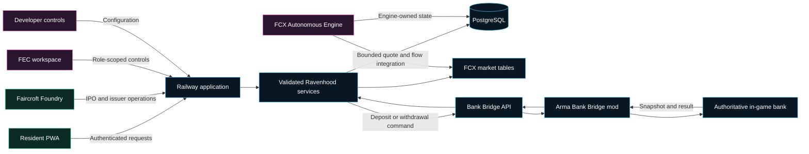
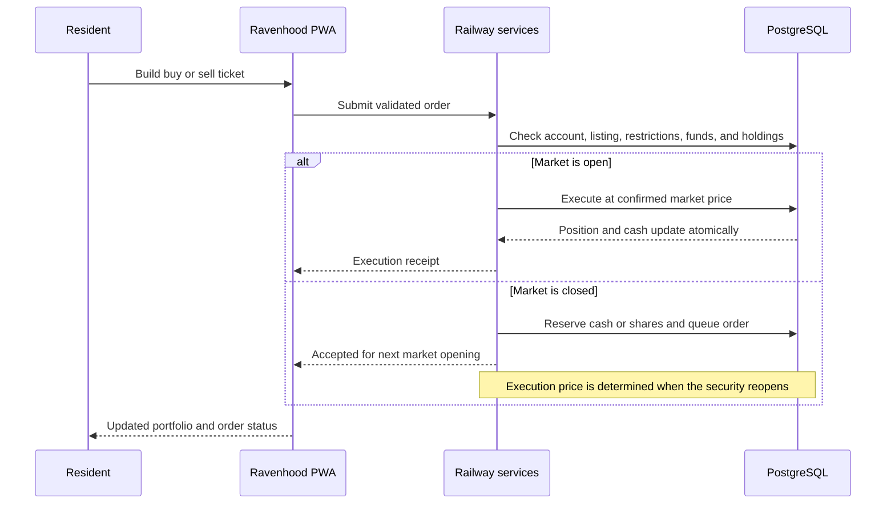
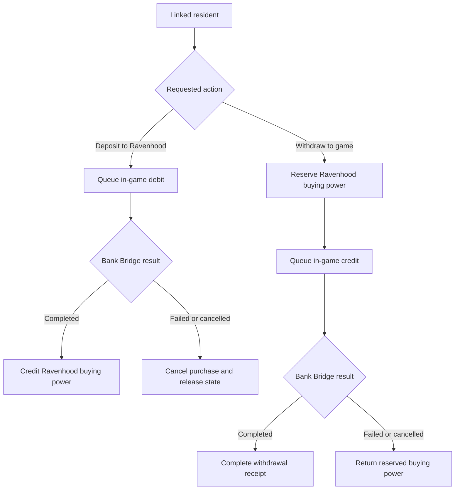
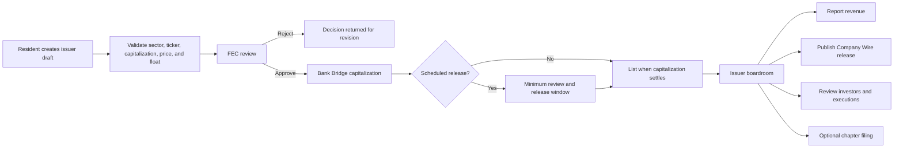

# Ravenhood Stock Exchange

## The Faircroft Exchange (FCX)

> A persistent, roleplay-native capital market connecting resident portfolios, autonomous market behavior, business IPOs, regulatory oversight, and verified in-game-currency settlement.

**Ravenhood** is the resident-facing trading platform for the **Faircroft Exchange (FCX)**. It joins modern equity trading, persistent simulated markets, resident-created IPOs, regulatory enforcement, and the Arma Reforger Bank Bridge in one auditable roleplay economy.

> [!IMPORTANT]
> Ravenhood and FCX are fictional roleplay systems. They do not accept real money, issue real securities, provide real brokerage services, or offer real investment advice.

---

## Table of contents

- [Executive overview](#executive-overview)
- [Platform at a glance](#platform-at-a-glance)
- [Why Ravenhood exists](#why-ravenhood-exists)
- [System architecture](#system-architecture)
  - [Compatibility boundaries](#compatibility-boundaries)
- [Resident experience](#resident-experience)
- [Market desk and charting](#market-desk-and-charting)
- [Equity trading](#equity-trading)
  - [Order lifecycle](#order-lifecycle)
  - [Market-closed orders](#market-closed-orders)
- [In-game currency settlement](#in-game-currency-settlement)
- [Margin, long, and short positions](#margin-long-and-short-positions)
- [FCXS and FCXV index funds](#fcxs-and-fcxv-index-funds)
- [FCX Autonomous Market Engine](#fcx-autonomous-market-engine)
  - [Persistent simulated investors](#persistent-simulated-investors)
  - [Market cycles](#market-cycles)
  - [Price discovery](#price-discovery)
  - [Local and AI-assisted operation](#local-and-ai-assisted-operation)
- [One-click exchange deployment](#one-click-exchange-deployment)
- [Faircroft Foundry and resident IPOs](#faircroft-foundry-and-resident-ipos)
  - [IPO lifecycle](#ipo-lifecycle)
  - [Issuer boardroom](#issuer-boardroom)
- [FEC Market Integrity Division](#fec-market-integrity-division)
  - [Surveillance](#surveillance)
  - [Market actions](#market-actions)
  - [Asset custody](#asset-custody)
- [Roles and permissions](#roles-and-permissions)
- [Developer control plane](#developer-control-plane)
- [Safety and reliability](#safety-and-reliability)
- [Audit and transparency](#audit-and-transparency)
- [Testing strategy](#testing-strategy)
- [Operational rollout](#operational-rollout)
- [What makes Ravenhood different](#what-makes-ravenhood-different)
- [Product boundaries](#product-boundaries)
- [Major API families](#major-api-families)
- [Configuration categories](#configuration-categories)
- [Closing statement](#closing-statement)

---

## Executive overview

Ravenhood is more than a stock-price interface. It is a complete financial institution inside the Faircroft roleplay environment.

The platform supports:

- Resident equity accounts, buying power, portfolios, and order history.
- Whole-share, fractional-share, and cash-sized orders.
- Immediate execution while the market is open.
- Orders that wait for the next opening price while the market is closed.
- Isolated long and short leveraged positions.
- FCXS Stability and FCXV Volatility index products.
- Persistent simulated investors, market makers, events, sentiment, and liquidity.
- Resident-created IPOs with FEC review and Bank Bridge capitalization.
- Issuer revenue reporting, company announcements, and investor intelligence.
- FEC investigations, halts, restrictions, delisting, and asset custody.
- Auditable deposits and withdrawals using Faircroft in-game currency.

Every major state-changing action is validated by the backend and recorded in PostgreSQL. The browser never receives database credentials, provider secrets, the Arma bridge secret, RCON credentials, or SFTP credentials.

---

## Platform at a glance

| Capability | Ravenhood implementation |
|---|---|
| Exchange | Faircroft Exchange (FCX) |
| Resident product | Ravenhood |
| Issuer product | Faircroft Foundry |
| Regulatory workspace | FEC Market Integrity Division |
| Operating universe | One-click bootstrap for 30 companies |
| Index products | FCXS Stability Index and FCXV Volatility Index |
| Market participants | Residents and persistent simulated brokerage accounts |
| Equity orders | Whole shares, fractional shares, or cash-based sizing |
| Market sessions | Immediate execution while open; queued execution at reopening price |
| Margin | Isolated long and short exposure with configurable leverage |
| Settlement | Ravenhood ledger plus Arma Bank Bridge deposits and withdrawals |
| Market intelligence | OHLC, EMA, VWAP, volatility, volume, market cap, rank, and order flow |
| Business formation | IPO creation, review, capitalization, scheduling, and issuer operation |
| Oversight | FEC surveillance, halts, account locks, delisting, custody, and audit |
| Automation | Local FCX engine with optional Gemini and DeepSeek-assisted review |
| Engine safety | Advisory lock, bounded cycles, circuit breakers, and kill switch |

---

## Why Ravenhood exists

Faircroft already has persistent identity, residents, businesses, government agencies, courts, and an in-game economy. Ravenhood turns those systems into a living capital market.

It creates distinct roleplay loops:

1. **Residents** invest, trade, manage risk, and follow market activity.
2. **Business controllers** form issuers, report revenue, and communicate with investors.
3. **FEC investigators** inspect activity and protect market integrity without trading.
4. **Developers** operate the exchange, configure risk, and schedule market events.
5. **Arma Reforger** remains authoritative for the resident's in-game bank snapshot.

Market activity can produce ongoing server stories: IPO launches, earnings surprises, rallies, crashes, liquidations, investigations, trading halts, bankruptcy filings, index rotations, and resident gains or losses.

---

## System architecture

### Compatibility boundaries

- Autonomous records use dedicated `fcx_engine_*` tables.
- The engine never writes resident cash, resident holdings, resident orders, Arma links, or Bank Bridge commands.
- Engine integration is limited to market quotes, price history, and anonymous system-flow records.
- Resident mutations pass through established Ravenhood service functions.
- In-game money movement passes through the existing Bank Bridge API.
- The browser never connects directly to the Arma server, RCON, SFTP, or a bridge secret.
- The RP Linking System and Bank Bridge remain independent compatibility boundaries.

---

## Resident experience

Ravenhood is organized around clear resident actions:

| Area | Purpose |
|---|---|
| Trade | Discover active securities and open a focused order ticket |
| Portfolio | Review positions, equity, buying power, and current gains or losses |
| Margin | Monitor isolated long and short exposure |
| Orders | View queued, open, executed, cancelled, and historical orders |
| Deposit | Move verified in-game funds into Ravenhood buying power |
| Withdraw | Return whole-dollar buying power to the linked in-game account |
| Transfer | Send eligible Ravenhood value through validated account workflows |
| Rewards | Redeem authorized Faircroft promotions |

The responsive order ticket provides:

- Buy or sell selection.
- Share-based or cash-based sizing.
- Whole-share sliders.
- Direct fractional-share entry.
- Live subtotal and fee estimates.
- Long/short controls when margin is enabled.
- A permitted-leverage slider.
- Desktop modal and mobile bottom-sheet layouts.
- Protection against auto-refresh interrupting active typing.

---

## Market desk and charting

Each security page combines market intelligence, account context, and execution.

### Available chart ranges

- Live
- 15 minutes
- 1 hour
- 1 day
- 1 week
- 1 month
- 1 year

### Market intelligence

- Recorded OHLC candles with readable bodies and wicks.
- EMA 12 trend line.
- Session volume-weighted average price (VWAP).
- Volatility band.
- Statistical outlook separated from recorded history.
- Executed volume.
- Buy pressure and sell pressure.
- Open, current, high, and low prices.
- Market capitalization.
- FCX market-cap ranking.
- Resident position and average cost.
- Anonymous live execution feed.

Residents can zoom, pan, move through recorded history, select a timeframe, and toggle chart series. Tooltips expose exact price and time without revealing another resident's identity.

---

## Equity trading

Equity requests are validated server-side before any position or cash changes.

### Order lifecycle

### Market-closed orders

When normal trading is closed:

- Equity orders may be submitted for the next session.
- The system reserves the required cash or shares.
- The order appears in the resident's Orders area.
- The resident may cancel it before execution.
- The order executes at the market price when the security reopens—not the earlier displayed price.
- Automatic stock movement follows exchange session configuration.

FCXV can be configured as a 24-hour market. When enabled, eligible FCXV equity and margin orders can execute while the rest of FCX is closed.

### Equity safeguards

- Verified Ravenhood account required.
- Active, listed, and tradeable security required.
- FEC account and security restrictions enforced by the backend.
- Minimum order value enforced.
- Fees confirmed at execution.
- Queued-order count bounded.
- Reserved value prevents double spending.
- Settlement occurs atomically.

---

## In-game currency settlement

Ravenhood buying power and the Arma bank have a deliberate, auditable bridge.

### Settlement principles

- The latest Arma bank snapshot is the authoritative reference for available game funds.
- A Ravenhood deposit debits the in-game bank before buying power is credited.
- A withdrawal issues money back to the linked Arma identity.
- Withdrawals use whole-dollar amounts.
- Command limits prevent one resident from flooding the bridge.
- Pending, claimed, completed, failed, cancelled, and retried commands remain auditable.
- A rejected command cancels the service or releases the reservation it was funding.
- Ravenhood activity history clearly notes that it does not include unrelated arsenal purchases or direct in-game transfers.

---

## Margin, long, and short positions

Ravenhood uses isolated positions so leverage does not silently become ordinary share ownership.

### Resident controls

- **Long:** profit when the mark rises above entry.
- **Short:** profit when the mark falls below entry.
- Collateral-based sizing.
- Configurable leverage selection.
- Live profit and loss.
- Entry price, mark price, exposure, liquidation boundary, and position equity.
- Manual close with realized profit or loss returned to Ravenhood buying power.
- Persistent closed-position ledger.

### Risk controls

- Global and per-security margin enablement.
- Maximum leverage from 5x through the permitted server ceiling.
- Universal and per-side leverage settings.
- Maximum position count.
- Maximum resident exposure.
- Minimum collateral.
- Maintenance and liquidation rules.
- Market-session enforcement.
- Optional FCXV 24-hour margin access.
- Equity-only, leverage-only, or full account restrictions.

FEC investigators can view Ravenhood and relevant investigative data, but the FEC Investigator role cannot trade.

---

## FCXS and FCXV index funds

| Index | Mandate | Default basket | Market profile |
|---|---|---:|---|
| **FCXS** | Faircroft Stability Index | 8 constituents | Lower-volatility operating companies |
| **FCXV** | Faircroft Volatility Index | 6 constituents | Highest-movement eligible companies |

Each fund exposes:

- Constituent list and weight.
- Resident fund holders.
- Resident fund units.
- Simulated brokerage units.
- Total fund units.
- Fund capitalization.
- Gemini or provider-assisted flow where applicable.
- Last rebalance time.
- Recorded quote history.

Index readiness is validated during exchange deployment. Rebalancing keeps resident holdings distinct from simulated market positions.

---

## FCX Autonomous Market Engine

The FCX engine lets Ravenhood behave like a persistent market even when residents are not actively trading.

### Persistent simulated investors

The engine can seed and maintain these personalities:

- Retail
- Conservative
- Growth
- Panic
- Contrarian
- Institutional
- Momentum
- Value
- Day trader
- Speculator
- Dividend
- Short seller
- Market maker
- Whale
- Algorithmic

Public interfaces describe these actors as fictional brokerage or market accounts. They are not residents and do not expose private identities.

### Market cycles

The engine supports:

- Minute
- 5-minute
- 15-minute
- 30-minute
- Hourly
- 6-hour
- Daily

Cycles can update:

- Investor decisions and parent/child orders.
- Market-maker liquidity and quotes.
- Fundamentals.
- Events and sentiment.
- Short interest and squeeze covering.
- Price history.
- FCXS and FCXV net asset value.
- Surveillance flags and risk state.

The engine can operate in Maintenance, Low, Normal, or High speed. A PostgreSQL advisory lock prevents overlapping cycles, and the kill switch stops autonomous work without shutting down the PWA or human trading.

### Price discovery

The market can account for:

- Buy and sell pressure.
- Available liquidity and depth.
- Market-maker spread.
- Fear/greed state.
- Market regime.
- Company fundamentals.
- Volatility and timeframe movement limits.
- IPO uncertainty and its decay.
- Dividends and stock splits.
- Short interest and squeeze behavior.
- Scheduled roleplay events.
- Circuit breakers and manual halts.

All automatic behavior remains bounded by price floors, timeframe caps, order sizing, execution budgets, and configured risk controls. The engine cannot silently resume a manual or FEC halt.

### Local and AI-assisted operation

| Source | Role |
|---|---|
| Local FCX engine | Deterministic, provider-independent market operation |
| Gemini | Optional market review and analyst briefing |
| DeepSeek | Optional alternate provider and fallback path |

Provider rate limits or outages do not have to stop FCX. Cooldowns, failover, and the local engine keep third-party availability separate from core exchange operation. API keys remain server-side.

---

## One-click exchange deployment

The developer control plane can bootstrap the complete FCX market from one controlled action.

### Deployment creates or repairs

1. Exactly 30 operating companies.
2. FCXS with 8 eligible constituents.
3. FCXV with 6 eligible constituents.
4. A persistent simulated investor population.
5. Engine configuration and scheduler state.
6. Opening market cycles and readiness metrics.

### Deployment does not alter

- Resident Ravenhood cash.
- Arma bank balances.
- Bank Bridge commands.
- Arma account links.
- Unrelated PWA records.

When the exchange has no operating listings, a fresh launch can clean stale index state without treating ordinary resident ledgers as engine-owned data.

---

## Faircroft Foundry and resident IPOs

Faircroft Foundry turns residents into public-company controllers instead of merely stock buyers.

### IPO lifecycle

### IPO guardrails

- Default minimum capitalization: **FC$3,000,000**, developer configurable.
- Developer-controlled maximum public float.
- Sector capacity limits prevent one industry from flooding FCX.
- Ticker, issuer text, price, capitalization, and share structure validated server-side.
- FEC approval required before capitalization.
- Scheduled IPOs require the configured review window.
- Capitalization is recognized only after Bank Bridge completion.

Legacy business-license records are not automatically converted to securities. A developer can explicitly assign an existing FCX security to a resident controller without turning old license records into IPOs.

### Issuer boardroom

An approved or assigned controller can view:

- Live company value and market capitalization.
- Reported revenue history.
- Exact time and valuation effect of each revenue report.
- Company treasury and capital ledger.
- Paid-in capital.
- Authorized shares and public float.
- Resident investors.
- Fictional brokerage-account holdings.
- Recent buys and sells involving the issuer.
- Company Wire history.
- Market activity and issuer statistics.
- Chapter filing controls.

Revenue recognized through the business dashboard is linked to the assigned security and can affect its market state through validated issuer services.

---

## FEC Market Integrity Division

The FEC workspace is Ravenhood's regulatory and investigative control plane.

### Surveillance

- Consolidated resident trade tape.
- Searchable resident executions.
- Resident portfolio and holdings review.
- Anonymous public flow with privileged investigative attribution.
- Realized and unrealized P&L windows for 12 hours, 1 day, and 1 week.
- Largest resident gains and losses.
- Large-withdrawal flags.
- Open leverage and liquidation monitoring.
- Controlled-liquidity pressure and suspicious-behavior review.

### Market actions

- Halt one security.
- Halt selected securities.
- One-click resume.
- Bulk resume selected securities.
- Resume all eligible securities.
- Delist without deleting issuer history.
- Relist an authorized security.
- Lock share trading only.
- Lock leverage trading only.
- Fully lock a Ravenhood account.
- Release an account restriction.
- Approve or reject IPO filings.

### Asset custody

- Document an FEC seizure with evidence, order, and authorization.
- Hold value in an auditable custody pool.
- Return funds to a cleared resident without penalty.
- Notify the resident that an investigation cleared them.
- Permanently forfeit authorized value.
- Reinvest an approved disposition across eligible market capitalization.
- Preserve the custody and disposition audit trail.

High-impact tools—including equity resets, share resets, permanent forfeiture, and retirement—remain restricted to developer-level authority.

---

## Roles and permissions

| Role | Ravenhood access |
|---|---|
| Resident | Trade, portfolio, orders, eligible margin, deposits, withdrawals, transfers, rewards |
| Business controller | Resident access plus assigned issuer boardroom and Company Wire |
| FEC Investigator | Read-only Ravenhood plus only the FEC Investigations workspace; no trading |
| Administrator | Core operations plus developer-delegated workspaces |
| Developer | Full configuration, engine, market, issuer, delegation, and high-impact controls |

Authorization is enforced by backend routes—not only hidden icons or navigation. App visibility improves the interface, while server-side permission checks remain authoritative.

---

## Developer control plane

The Stock Market and delegated developer workspaces provide:

- FCX deployment and launch-readiness checks.
- Engine speed, population, capital, liquidity, sentiment, and volatility settings.
- Market schedule, manual open/close, and FCXV 24-hour trading controls.
- Equity fees, leverage, exposure, collateral, and maintenance settings.
- Company generation and custom listings.
- Splits, dividends, bankruptcy, index eligibility, and rebalancing.
- Exact-price or percentage movement programs.
- Immediate or precisely scheduled roleplay movements.
- Single-security, index, selected-group, or entire-market targeting.
- Local, Gemini, and DeepSeek operating modes.
- Circuit breakers and surveillance thresholds.
- Deterministic sandbox simulations.
- Logs showing cycle type, provider, source, result, and exchange movement.
- Delegated Administrator access for approved operational sections.

All secrets and privileged mutations stay server-side.

---

## Safety and reliability

### Database and worker safety

- Bounded database connection pools protect PWA and bridge traffic.
- PostgreSQL advisory locks prevent overlapping engine ticks.
- Idempotent commands protect against duplicate mutations.
- Engine-owned tables avoid cascades into Arma bridge records.
- Atomic order settlement prevents partial cash or position changes.
- Background notification or AI failure cannot block core settlement.

### Market safety

- Price floors.
- Bounded timeframe movement.
- 10-minute and 30-minute circuit-breaker thresholds.
- Explicit resume for manual and FEC halts.
- Account and security restrictions.
- Market-session queuing.
- Position, collateral, exposure, and order-count limits.
- Market-maker spread and depth controls.
- Bankruptcy watch, Chapter 11, Chapter 7, and delisting thresholds.
- Controlled rollout speeds and deterministic sandbox testing.

### Integration safety

- No direct browser connection to Arma, RCON, or SFTP.
- Bank Bridge failure cannot silently create a completed Ravenhood transfer.
- AI-provider failure does not prevent local market operation.
- Resident account records remain outside autonomous engine ownership.

---

## Audit and transparency

Ravenhood records:

- Equity orders and executions.
- Queued-order reservations and cancellations.
- Margin openings, marks, liquidations, and closures.
- Deposits and withdrawals.
- Bank Bridge command status.
- Transfers and promotions.
- Simulated market executions.
- Engine cycles and autonomous decisions.
- Company capitalization and reported revenue.
- IPO approvals and rejections.
- Company Wire releases.
- FEC halts, account restrictions, custody, dispositions, delistings, and relistings.

Public feeds remain anonymous. Investigative identity detail is limited to authorized FEC and developer workspaces.

---

## Testing strategy

### Engine tests

- FCXS/FCXV readiness and index net asset value.
- Simulated-investor distributions and deterministic decisions.
- Order caps, liquidity, price floors, and market-maker bounds.
- Event taxonomy.
- Short-squeeze behavior.
- IPO uncertainty decay.
- Stock splits preserving total market value.
- Reproducible sandbox results.

### Trading tests

- Immediate equity orders.
- Market-closed queued orders.
- Execution at reopening price.
- Fractional and cash-sized tickets.
- Margin mathematics and atomic settlement.
- Long/short restrictions.
- FCXV session overrides.
- Chart history, zoom, pan, OHLC, and volume reconstruction.
- Anonymous trade tape and time-windowed P&L.

### Issuer and FEC tests

- IPO validation and configurable minimum capitalization.
- Review window for scheduled releases.
- FEC approval before Bank Bridge capitalization.
- Bridge completion before recognizing funding or revenue.
- Issuer audit and investor intelligence.
- FEC Investigator isolation and no-trade enforcement.
- Account restrictions, halts, resume, delisting, and release controls.

---

## Operational rollout

1. Apply the schema and confirm application health.
2. Run deterministic 1-day, 7-day, 30-day, and 365-day sandbox simulations.
3. Deploy or repair the 30-company FCX universe.
4. Confirm FCXS and FCXV constituent readiness.
5. Seed the persistent simulated-investor population.
6. Run manual minute, hourly, and daily cycles.
7. Start the engine in **Low** mode.
8. Verify movement caps, liquidity, circuit breakers, flags, and PWA responsiveness.
9. Increase speed only after stable operation.
10. Keep resident ledgers, bridge callbacks, and FEC activity under continuous audit.

---

## What makes Ravenhood different

Ravenhood is not a pasted market widget and not a real-money trading product. It is an integrated roleplay institution:

- The market has persistent participants and state.
- Resident decisions interact with liquidity, pricing, and business activity.
- Businesses can become issuers instead of static licenses.
- Government has a real investigative and regulatory role.
- In-game funds cross the boundary through an auditable bridge.
- The autonomous engine is constrained and isolated from resident ledgers.
- Major actions produce records staff can inspect.
- Market stories can continue when no resident is actively trading.

---

## Product boundaries

> [!CAUTION]
> Ravenhood uses fictional Faircroft in-game credits only. FCX companies, index funds, brokerage accounts, insurance, investigations, returns, and market events have no real-world monetary value.

The platform must always preserve:

- Clear in-game currency labeling.
- No real-money deposit or withdrawal path.
- No claim that FCX securities are real securities.
- No real investment advice.
- Server-side permissions and validation.
- Separation between resident records, developer controls, FEC oversight, Arma integrations, and autonomous-engine state.

---

## Major API families

<strong>Resident Ravenhood services</strong>

- Market bootstrap and account state.
- Equity cash, orders, and cancellations.
- Margin positions and closures.
- Recipient lookup and transfers.
- Promotion redemption.

<strong>Developer market control</strong>

- Engine settings, deployment, seed, cycles, and sandbox.
- Market schedule and session controls.
- Equity and leverage settings.
- Security creation and generation.
- Splits, dividends, bankruptcy, and index rebalancing.
- Price programs, presets, automation, AI briefings, and liquidation hunts.

<strong>FEC services</strong>

- Consolidated trade tape and resident portfolios.
- Account restrictions and releases.
- Asset custody and pool dispositions.
- Security halt, one-click resume, and bulk resume.
- Delist, relist, retire, and IPO review.

<strong>Issuer network</strong>

- IPO drafting and review.
- Bank Bridge capitalization.
- Scheduled release.
- Contributions and revenue reporting.
- Company Wire announcements.
- Controller assignment and transfer.
- Chapter filing.

---

## Configuration categories

- Engine enabled state, speed, and kill switch.
- Investor population and starting capital.
- Price floor and timeframe caps.
- Liquidity, spread, depth, and execution budget.
- Panic participation and sentiment sensitivity.
- Event probability and event mix.
- Circuit-breaker windows and thresholds.
- Surveillance metrics.
- Bankruptcy and delisting thresholds.
- Short selling and IPO uncertainty.
- Market schedule and FCXV 24-hour override.
- Equity fees, leverage, exposure, collateral, and maintenance.
- IPO minimum capitalization, public-float ceiling, and sector limits.
- Provider selection, cooldowns, and local fallback.

---

## Closing statement

**Ravenhood makes Faircroft's economy observable, investable, governable, and alive.**

It gives residents a polished exchange, issuers a capital market, investigators a regulatory workspace, developers a bounded simulation engine, and the RP server a continuous source of economic stories—while keeping settlement, permissions, and the Arma bridge auditable.

---

*GitHub presentation prepared for Thunderlink Core CAD.*
